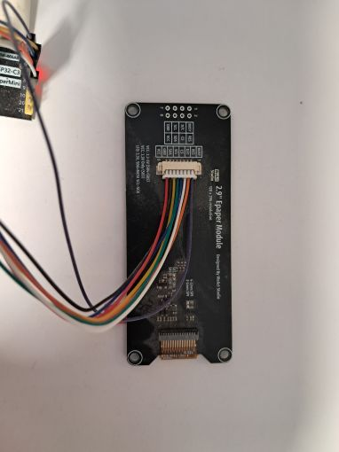
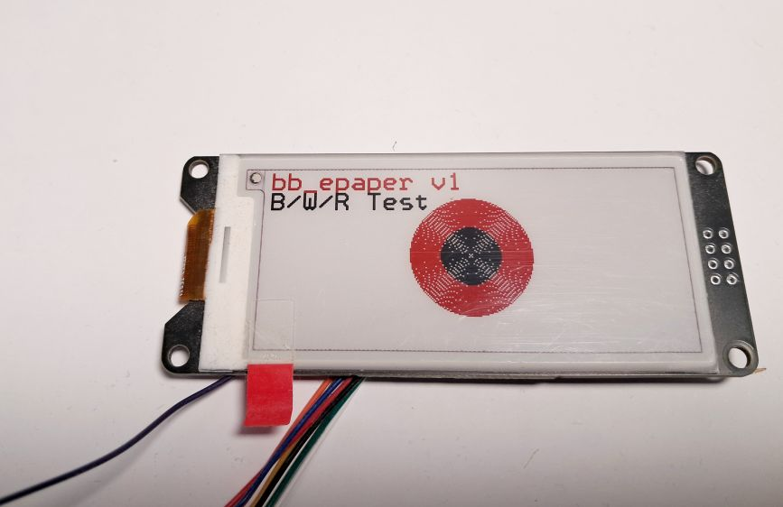
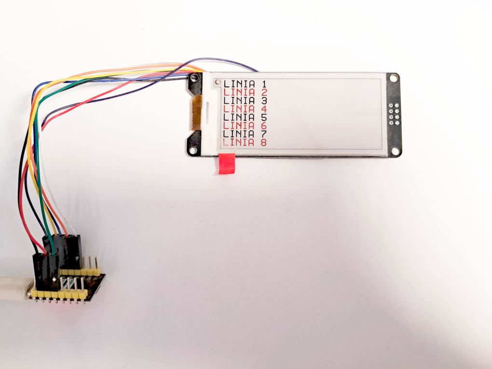

bb_epaper fork - EP29Rv2_128x296
================================
A fork of the [bb_epaper](https://github.com/bitbank2/bb_epaper) e-paper library by BitBank Software / Larry Bank, extended with support for the 2.9" 128x296 Black/White/Red panel.

<br>
<b>What's different from upstream</b><br>
Upstream bb_epaper already had no usable path for this specific display - the existing `EP29R_128x296` entry fails to drive it correctly. This fork adds a new, tested panel type.

<b>New in this fork: EP29Rv2_128x296</b>
A new panel type `EP29Rv2_128x296` has been added for the 2.9" 128x296 Black/White/Red e-paper display (GoodDisplay **GDEM029C90**, SSD1680 controller).

This is a purely additive change - the existing `EP29R_128x296` and `EP26R_152x296` entries are left untouched.

<b>What was added</b>
- New enum value `EP29Rv2_128x296` in `src/bb_epaper.h`, just before `EP_PANEL_COUNT`
- New init sequence `epd29rv2_init_sequence_full` in `src/bb_ep.inl`, matching `GxEPD2_290_C90c::_InitDisplay()`:
  - `0x21` (Display Update Control 1) sent with **2 data bytes** (`0x00, 0x80`) - the SSD1680 expects 2 bytes here; sending only 1 desynchronises the rest of the init sequence
  - `0x3C` border waveform = `0x05`
  - RAM X end = `0x0F` (128 px), RAM Y end = `0x0127` (296 rows)
  - RAM Y counter starts at 0
- New `panelDefs[]` entry: `{128, 296, 0, epd29rv2_init_sequence_full, NULL, NULL, BBEP_3COLOR, BBEP_CHIP_SSD16xx, u8Colors_3clr}`
- `bbepRefresh()` special case for `EP29Rv2_128x296` using display update control `0xF7` (full LUT refresh, same as GxEPD2_290_C90c `_Update_Full()`), instead of the default 3-color `0xC7`

<b>Why not reuse EP29R_128x296?</b>
`EP29R_128x296` exists but its init sequence has issues on this panel:
- `0x21` sent with only 1 data byte (SSD1680 requires 2)
- master activation (`0x20`) commented out
- RAM Y counter initialised to the last row instead of 0

Those are left as-is to avoid regressions for anyone currently using `EP29R_128x296`; the new panel type provides a correct, tested path for the GDEM029C90.

<b>Usage</b>
```
BBEPAPER bbep(EP29Rv2_128x296);
```

<b>Tested</b>
- Hardware: WeAct Studio ESP32-C3 + 2.9" 128x296 B/W/R panel (GDEM029C90)
- Pins: CS=7, DC=9, RES=8, BUSY=5, MOSI=6, SCLK=4
- Full-screen black/white/red fills: correct, no Y offset, no garbage rows
- Alternating black/red text lines across the whole display: correct
- Text + circles + bitmap (three_color example content, rotation 270): correct

<br>

<br>
Hardware: WeAct Studio 2.9" 128x296 B/W/R e-paper module (GDEM029C90, SSD1680) driven by an ESP32-C3 SuperMini. Pins: CS=7, DC=9, RES=8, BUSY=5, MOSI=6, SCLK=4.
<br>

<br>

<br>
Full-screen black/white/red fills run correct with no Y offset or garbage rows; alternating black/red text lines display correctly across the whole panel.